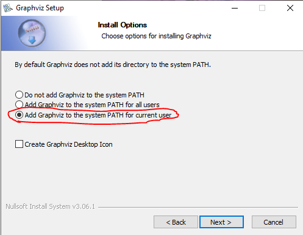

# CA03_Decision_Tree_Classifier Notebook

This Jupyter Notebook provides an implementation of a Decision Tree Classifier. It is intended for educational purposes and to demonstrate the application of decision tree algorithms in machine learning.

## Prerequisites

Before running this notebook, please ensure that you have the following prerequisites installed:

- Python 
- Jupyter Notebook

# MUST READ DO NOT SKIP OVER THIS
# PLEASE DO THIS BEFORE RUNNING THE NOTEBOOK!!!

## Graphviz Installation Guide

The notebook uses Graphviz for visualizing decision trees. You need to have Graphviz installed and added to your system PATH to render the trees correctly.

### Windows Users

For Windows users, follow these steps:

1. Download the "windows_10_cmake_Release_graphviz-install-9.0.0-win64" document.
2. Run the Graphviz installer.
3. During the installation process, ensure that you perform the step to add Graphviz to the system PATH for the current user, as shown in the attached "DownloadInstruction" image.

Make sure to complete this particular step to avoid issues with running the decision tree visualizations in the notebook.

## Running the Notebook

Once you have installed the prerequisites and Graphviz, you can run the notebook `CA03_Decision_Tree_Classifier.ipynb` by opening it in Jupyter Notebook or JupyterLab and executing the cells in order.
The notebook has %pip install commands preset so that if any packages are not already installed on the device you are using to run the notebook, it will install them for you. 
If you know that you already have all of the packages in the notebook, feel free to comment/remove them out before running the notebook.

If you encounter any issues, please ensure that all the prerequisites are correctly installed and that Graphviz is properly added to your system PATH as outlined in the installation steps.

## Contact

For any queries or issues related to this notebook, please open an issue in the repository or contact the repository maintainer.
Email: mdosher@lion.lmu.edu
